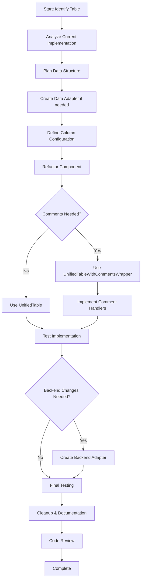

# Table Refactoring Skill

**Goal**: Guide developers through refactoring existing custom tables to use the UnifiedTable and UnifiedTableWithCommentsWrapper components.

## Skill Overview

This skill helps developers:
1. Analyze existing table implementations
2. Map data structures and features to UnifiedTable props
3. Create data adapter/wrapper layers if needed
4. Refactor the table component to use UnifiedTable
5. Integrate with existing backend APIs
6. Test and validate the refactored implementation

## Prerequisites

Before starting, ensure you have:
- Access to the UnifiedTable USAGE guide at `klair-client/src/components/tables/UnifiedTable/USAGE.md`
- Understanding of the existing table's functionality
- Knowledge of the backend API structure

## Refactoring Process

### Phase 1: Analysis

**Step 1.1: Identify the Target Table**
- Ask the developer which table component they want to refactor
- Locate the component file (usually in `klair-client/src/components/` or `klair-client/src/screens/`)
- Read the component file and understand its structure

**Step 1.2: Analyze Current Implementation**
Identify the following:
- **Data source**: Where does the data come from? (API endpoint, props, context)
- **Data structure**: Is it flat/simple data or hierarchical/nested?
- **Columns**: What columns are being displayed? Any custom renderers?
- **Features**: What features are implemented?
  - Sorting (which columns?)
  - Filtering/Search (which columns?)
  - Pagination (page size, controls)
  - Expandable rows/accordion
  - Export functionality
  - Total rows/summary rows
  - Comments functionality
  - Custom actions/buttons
- **Styling**: Any custom styling or themes?
- **Interactivity**: Click handlers, row selection, etc.

**Step 1.3: Check Backend API**
- Locate the API endpoint that provides the data
- Understand the response structure
- Identify if any transformations are needed
- Check if backend supports features like pagination, sorting, filtering

### Phase 2: Planning

**Step 2.1: Determine Data Structure Type**
Based on analysis, classify the table:
- **Simple Data**: Flat array of objects → Use `UnifiedTable` with `data={{ data: [] }}`
- **Hierarchical Data**: Nested structure → Use `UnifiedTable` with `data={{ sections: [] }}`
  - Ensure each section has `level` and `expandable` properties
  - Use `children` for nested levels, `items` for leaf data

**Step 2.2: Select Feature Preset**
Choose the closest preset from:
- `TABLE_PRESETS.BASIC` - Basic table with sorting, pagination, search
- `TABLE_PRESETS.ACCORDION` - Expandable rows
- `TABLE_PRESETS.COMMENTS` - Table with comments functionality
- `TABLE_PRESETS.CATALOG` - Product catalog with hierarchy
- `TABLE_PRESETS.CORPORATE` - Corporate hierarchy
- `TABLE_PRESETS.FINANCIAL` - Financial data table

Or create custom features object combining specific features.

**Step 2.3: Plan Data Adapter Layer**
If the backend data structure doesn't match UnifiedTable expectations:
- Create a data adapter function to transform backend response
- Map backend fields to expected column keys
- Add required fields for hierarchical data (`level`, `expandable`)
- Handle any data normalization

**Step 2.4: Plan Column Definitions**
Map existing columns to `ColumnDef` format:
```typescript
{
  key: string,           // Field name in data
  header: string,        // Column header text
  sticky?: boolean,      // First column sticky?
  align?: 'left' | 'right' | 'center',
  formatType?: 'currency' | 'number' | 'percentage' | 'auto',
  currencySymbol?: string,
  decimalPlaces?: number,
  render?: (value, row) => ReactNode,  // Custom renderer
  tooltip?: string
}
```

### Phase 3: Implementation

**Step 3.1: Create Data Adapter (if needed)**
Create a utility function to transform backend data:
```typescript
// klair-client/src/utils/adapters/[tableName]Adapter.ts
export const adapt[TableName]Data = (backendData: BackendType): TableData<FrontendType> => {
  // For simple data
  return {
    data: backendData.items.map(item => ({
      // Map backend fields to frontend fields
      id: item.itemId,
      name: item.itemName,
      // ... other mappings
    }))
  };

  // For hierarchical data
  return {
    sections: backendData.categories.map(category => ({
      id: category.id,
      name: category.name,
      summary: { /* summary fields */ },
      level: 0,
      expandable: true,
      children: /* map nested children */
    }))
  };
};
```

**Step 3.2: Define Column Configuration**
Create column definitions:
```typescript
const columns: ColumnDef<YourDataType>[] = [
  {
    key: 'name',
    header: 'Name',
    sticky: true,
    tooltip: 'Item name'
  },
  {
    key: 'revenue',
    header: 'Revenue',
    formatType: 'currency',
    align: 'right',
    decimalPlaces: 2
  },
  // ... other columns
];
```

**Step 3.3: Refactor Component**
Replace the existing table implementation with UnifiedTable:

**For tables WITHOUT comments:**
```typescript
import { UnifiedTable, TABLE_PRESETS } from '@/components/tables/UnifiedTable';
import { adapt[TableName]Data } from '@/utils/adapters/[tableName]Adapter';

const [TableName]Component = () => {
  // Fetch data (keep existing data fetching logic)
  const { data: backendData, isLoading } = useYourDataHook();

  // Adapt data
  const tableData = useMemo(() => {
    if (!backendData) return { data: [] };
    return adapt[TableName]Data(backendData);
  }, [backendData]);

  // Column definitions
  const columns = useMemo(() => [/* your columns */], []);

  if (isLoading) return <LoadingSpinner />;

  return (
    <UnifiedTable
      data={tableData}
      columns={columns}
      features={{
        ...TABLE_PRESETS.BASIC,  // or other preset
        // Override specific features if needed
        totalRow: true,
        export: true,
      }}
      title="Your Table Title"
      description="Optional description"
      searchableColumns={['name', 'email']}
      pageSize={10}
      initialSort={{ key: 'name', direction: 'ascending' }}
      totalRowConfig={{
        position: 'bottom',
        calculate: true,
        label: 'Total',
        excludeColumns: ['name', 'status']
      }}
      // ... other props
    />
  );
};
```

**For tables WITH comments:**
```typescript
import { UnifiedTableWithCommentsWrapper } from '@/components/tables/UnifiedTable/UnifiedTableWithCommentsWrapper';
import { TABLE_PRESETS } from '@/components/tables/UnifiedTable';
import { adapt[TableName]Data } from '@/utils/adapters/[tableName]Adapter';

const [TableName]Component = () => {
  // Fetch data
  const { data: backendData, isLoading } = useYourDataHook();

  // Adapt data
  const tableData = useMemo(() => {
    if (!backendData) return { data: [] };
    return adapt[TableName]Data(backendData);
  }, [backendData]);

  // Column definitions
  const columns = useMemo(() => [/* your columns */], []);

  // Comment handlers
  const handleCommentCreate = async (comment: Comment) => {
    const response = await fetch('/api/comments', {
      method: 'POST',
      headers: { 'Content-Type': 'application/json' },
      body: JSON.stringify(comment)
    });
    return response.ok;
  };

  const handleCommentUpdate = async (commentId: string, updates: Partial<Comment>) => {
    const response = await fetch(`/api/comments/${commentId}`, {
      method: 'PATCH',
      headers: { 'Content-Type': 'application/json' },
      body: JSON.stringify(updates)
    });
    return response.ok;
  };

  const handleCommentDelete = async (commentId: string) => {
    const response = await fetch(`/api/comments/${commentId}`, {
      method: 'DELETE'
    });
    return response.ok;
  };

  const handleCommentThreadDelete = async (documentId: string, elementId: string) => {
    const response = await fetch(`/api/comments/thread`, {
      method: 'DELETE',
      headers: { 'Content-Type': 'application/json' },
      body: JSON.stringify({ documentId, elementId })
    });
    return response.ok;
  };

  if (isLoading) return <LoadingSpinner />;

  return (
    <UnifiedTableWithCommentsWrapper
      data={tableData}
      columns={columns}
      features={TABLE_PRESETS.COMMENTS}
      title="Your Table Title"
      sectionType="your-table-type"
      commentsIdField="id"
      documentId="your-document-id"
      onCommentCreate={handleCommentCreate}
      onCommentUpdate={handleCommentUpdate}
      onCommentDelete={handleCommentDelete}
      onCommentThreadDelete={handleCommentThreadDelete}
      searchableColumns={['name', 'email']}
      pageSize={10}
      // ... other props
    />
  );
};
```

**Step 3.4: Handle Custom Features**
If the existing table has custom features not directly supported:

**Custom Header Controls:**
```typescript
<UnifiedTable
  // ... other props
  customHeaderControls={
    <div className="flex items-center gap-2">
      <button onClick={handleCustomAction}>Custom Action</button>
      <select onChange={handleFilter}>
        <option>Filter Option</option>
      </select>
    </div>
  }
/>
```

**Custom Cell Renderers:**
```typescript
const columns: ColumnDef<DataType>[] = [
  {
    key: 'status',
    header: 'Status',
    render: (value, row) => (
      <span className={`badge ${value === 'active' ? 'success' : 'warning'}`}>
        {value}
      </span>
    )
  }
];
```

### Phase 4: Backend Integration

**Step 4.1: Review Backend Requirements**
Check if the backend needs modifications:
- Does it provide data in the expected structure?
- Does it support pagination parameters?
- Does it support sorting parameters?
- Does it support filtering/search parameters?

**Step 4.2: Create Backend Adapter (if needed)**
If the backend structure is very different, create a backend endpoint adapter:
```python
# klair-api/routers/[table_name]_adapter.py
from fastapi import APIRouter, Query
from typing import Optional

router = APIRouter()

@router.get("/api/v2/[table-name]")
async def get_table_data(
    page: Optional[int] = Query(1),
    page_size: Optional[int] = Query(10),
    sort_by: Optional[str] = Query(None),
    sort_direction: Optional[str] = Query("asc"),
    search: Optional[str] = Query(None)
):
    # Call existing backend logic
    original_data = await get_original_data()

    # Transform to UnifiedTable format
    adapted_data = {
        "data": [
            {
                "id": item.id,
                "name": item.display_name,
                # ... map other fields
            }
            for item in original_data
        ]
    }

    return adapted_data
```

**Step 4.3: Update API Service**
Update the frontend API service to use the new endpoint:
```typescript
// klair-client/src/services/[tableName]Service.ts
export const fetch[TableName]Data = async (
  page?: number,
  pageSize?: number,
  sortBy?: string,
  sortDirection?: string,
  search?: string
) => {
  const params = new URLSearchParams();
  if (page) params.append('page', page.toString());
  if (pageSize) params.append('page_size', pageSize.toString());
  if (sortBy) params.append('sort_by', sortBy);
  if (sortDirection) params.append('sort_direction', sortDirection);
  if (search) params.append('search', search);

  const response = await fetch(`/api/v2/[table-name]?${params}`);
  return response.json();
};
```

### Phase 5: Testing

**Step 5.1: Functional Testing**
Test all features:
- ✓ Data loads correctly
- ✓ Columns display properly
- ✓ Sorting works on all sortable columns
- ✓ Search/filtering works
- ✓ Pagination works
- ✓ Expandable rows work (if hierarchical)
- ✓ Total rows calculate correctly
- ✓ Export functionality works
- ✓ Comments functionality works (if enabled)
- ✓ Custom actions work

**Step 5.2: Visual Testing**
Compare with the original table:
- Layout matches or improves
- Styling is consistent
- Responsive behavior works
- Dark mode support (if applicable)

**Step 5.3: Performance Testing**
- Large datasets load efficiently
- Pagination reduces render load
- Sorting is responsive
- Search/filtering is performant

**Step 5.4: Edge Cases**
Test with:
- Empty data
- Single row
- Maximum rows
- Very long text in cells
- Null/undefined values

### Phase 6: Cleanup

**Step 6.1: Remove Old Code**
- Delete old table component file (after backing up)
- Remove unused utility functions
- Clean up unused imports
- Update tests to reference new component

**Step 6.2: Update Documentation**
- Update component documentation
- Update API documentation if backend changed
- Add comments explaining the data adapter
- Document any custom features

**Step 6.3: Code Review Checklist**
Before submitting:
- [ ] TypeScript types are properly defined
- [ ] No console warnings or errors
- [ ] Follows project coding standards
- [ ] Comments explain complex logic
- [ ] No unused code or imports
- [ ] Tests pass (if applicable)

## Common Patterns and Solutions

### Pattern 1: Simple Table Migration
**Use Case**: Basic table with flat data, sorting, and pagination.
**Solution**: Use `TABLE_PRESETS.BASIC` with minimal configuration.

### Pattern 2: Hierarchical Data with Custom Levels
**Use Case**: Multi-level nested data with different rendering at each level.
**Solution**: Use `recursiveSubTables` to define custom components for different levels.

### Pattern 3: Financial Data with Totals
**Use Case**: Financial data requiring calculated totals.
**Solution**: Use `TABLE_PRESETS.FINANCIAL` with `totalRowConfig`.

### Pattern 4: Backend Data Mismatch
**Use Case**: Backend returns different field names or structure.
**Solution**: Create a data adapter function to transform the data.

### Pattern 5: Complex Filtering
**Use Case**: Multiple filters that aren't just search.
**Solution**: Use `customHeaderControls` and manage filtered data in parent component with `useMemo`.

### Pattern 6: Comments on Hierarchical Data
**Use Case**: Need comments functionality on nested/hierarchical tables.
**Solution**: Use `UnifiedTableWithCommentsWrapper` with proper `commentsIdField`. The component handles path-based IDs automatically.

### Pattern 7: Preserving Custom Actions
**Use Case**: Existing table has row actions (edit, delete, etc.).
**Solution**: Add action column with custom `render` function:
```typescript
{
  key: 'actions',
  header: 'Actions',
  render: (_, row) => (
    <div className="flex gap-2">
      <button onClick={() => handleEdit(row)}>Edit</button>
      <button onClick={() => handleDelete(row)}>Delete</button>
    </div>
  )
}
```

## Troubleshooting

### Issue: Data not displaying
**Check**:
- Is data structure correct? (`{ data: [] }` or `{ sections: [] }`)
- Are column keys matching data keys?
- Is data being fetched successfully?

### Issue: Sorting not working
**Check**:
- Is `disableSorting` set to false?
- Are column keys correct?
- Is data type appropriate for sorting?

### Issue: Comments not highlighting correctly
**Check**:
- Is `commentsIdField` pointing to the correct field?
- Do all rows/sections have the ID field?
- Are comment element IDs formatted correctly?

### Issue: Hierarchical data not expanding
**Check**:
- Do sections have `level` and `expandable` properties?
- Is data structure using `children` and `items` correctly?
- Are summary rows defined properly?

### Issue: Performance issues with large datasets
**Solutions**:
- Enable pagination with reasonable `pageSize`
- Use `rowHeight: 'compact'` for dense data
- Memoize expensive render functions
- Consider server-side pagination

## Reference

For complete API documentation and examples, refer to:
- `klair-client/src/components/tables/UnifiedTable/USAGE.md` - Complete usage guide
- `klair-client/src/components/tables/UnifiedTable/INTERNAL.md` - Internal implementation details
- `/components-demo` - Live examples and demos

## Workflow Summary



## Best Practices

1. **Always create a data adapter layer** - Don't modify the backend unless absolutely necessary
2. **Use TypeScript types** - Define proper types for your data and columns
3. **Memoize expensive operations** - Use `useMemo` for data transformations and column definitions
4. **Test incrementally** - Test each feature as you add it
5. **Preserve existing functionality** - Ensure all original features work in the refactored version
6. **Document custom features** - Add comments explaining any custom logic
7. **Use proper presets** - Start with the closest preset and customize from there
8. **Handle edge cases** - Test with empty data, single rows, and maximum rows
9. **Consider performance** - Use pagination for large datasets
10. **Maintain consistency** - Follow the project's styling and coding standards

## Execution Mode

When this skill is invoked:

1. **Read the USAGE.md file** at `klair-client/src/components/tables/UnifiedTable/USAGE.md`
2. **Ask the developer** which table component they want to refactor
3. **Follow the phases** sequentially: Analysis → Planning → Implementation → Backend Integration → Testing → Cleanup
4. **Be proactive** - Suggest improvements and best practices along the way
5. **Create all necessary files** - Data adapters, updated components, backend endpoints if needed
6. **Run tests** - Ensure the refactored component works correctly
7. **Provide a summary** - At the end, summarize what was done and what to test

Always refer to the USAGE.md file for the most up-to-date API documentation and examples.
